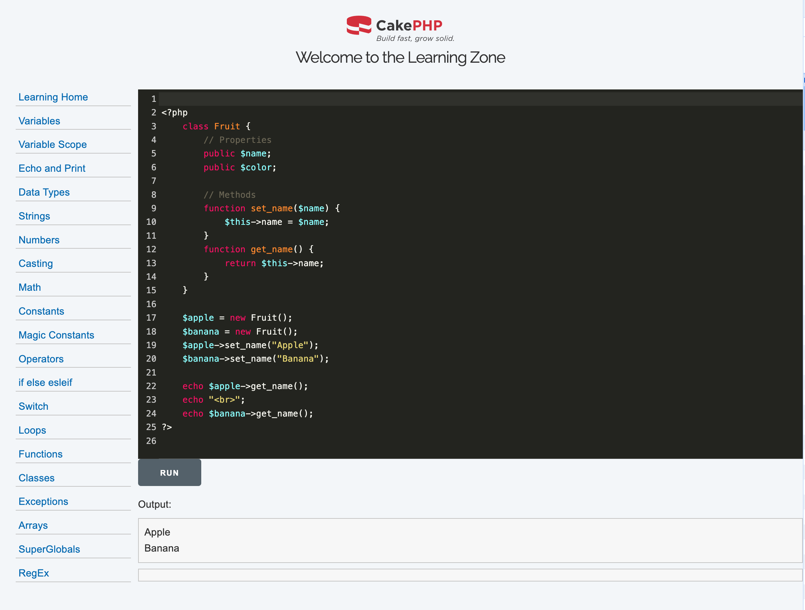

# Project Name: php-starter

## Description
This project serves as a starter for PHP experimentation using php 7 specifically for working with legacy systems. It provides a basic structure and configuration to help you kickstart your PHP development.

## Prerequisites
Before using this project, make sure you have the following installed on your system:
- Docker Desktop
- Node.js

## Installation
1. Clone the repository: `git clone https://github.com/GRuggieriTES/php7-starter.git`
2. Navigate to the project directory: `cd php7-starter`
3. Spin up the services `npm run start`
4. Open a new shell terminal, to interact with the PHP command line, shell into the php container `docker exec -it php /bin/bash`
5. After the above, should be in the working directory, `myapp` where the project resides.
6. Install PHP dependencies `composer install`

## Stop services
1. Within the docker terminal you used to to `npm start` do `CTRL+c`
2. Stop and delete containers `npm stop`

## Usage
Once the container is up and running

1. The app: `http://localhost:3000/mysql` is the example php page for accessing a users database
2. For getting PHP setup inforamtion, `http://localhost:3000/info`
3. An example cake PHP application `http://localhost:3000//users` showing the same example as point 1, but generated MVC classes, full crud :)
2. The phpMyAdmin MySQL client app `http://localhost:3001` Login - UN: `myuser`, PW: `mypassword`

## Customization
Feel free to customize this project according to your needs. Here are a few areas you might want to consider:
- Update the project name and description in the `README.md` file.
- Modify the project structure to fit your application's requirements.
- Add your own PHP files and logic.
- Update the `composer.json` file to include any additional dependencies.

## Contributing
If you would like to contribute to this project, please follow these steps:
1. Fork the repository.
2. Create a new branch: `git checkout -b feature/your-feature-name`
3. Make your changes and commit them: `git commit -m "Add your commit message"`
4. Push to the branch: `git push origin feature/your-feature-name`
5. Open a pull request.

## License
This project is licensed under the [MIT License](https://opensource.org/licenses/MIT).
